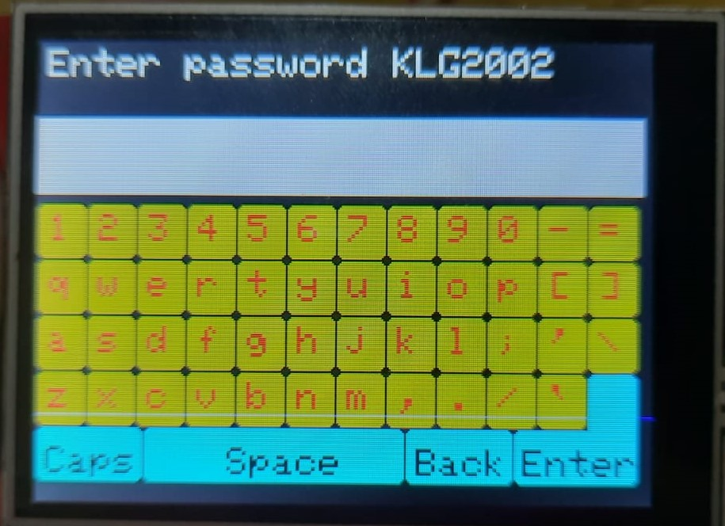
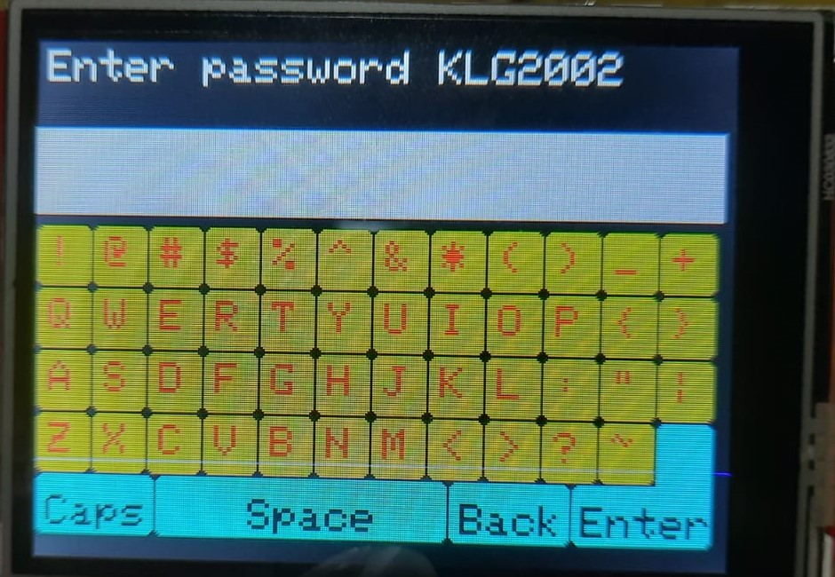

# Keyboard for 2.8 inch touch display

This keyboard is originally written with the intent of acquiring the WiFi password from a user via the touch display. Feel free to modify as you want. (I didn't know there is something called SquareLine Studio and LVGL for embedded UI Developemnt 😐)

  
  

